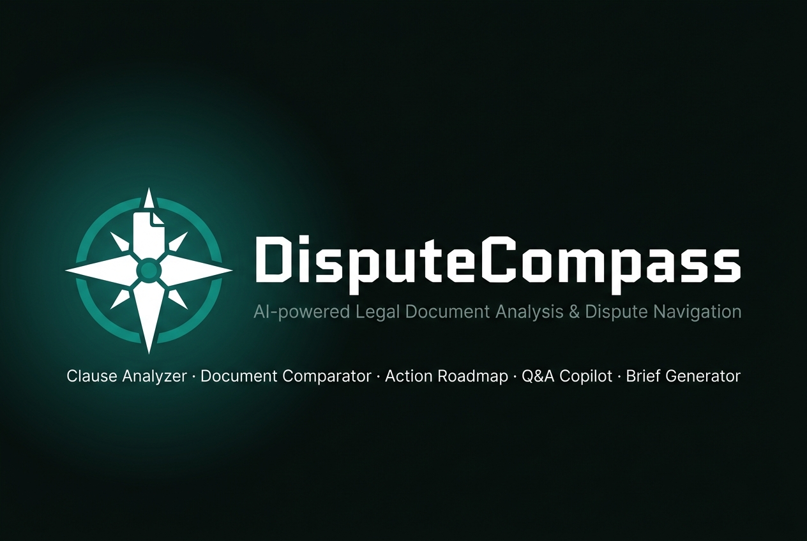

<div align="center">



<br/>

[](https://nextjs.org/)
[](https://react.dev/)
[](https://www.typescriptlang.org/)
[](https://tailwindcss.com/)
[](https://build.nvidia.com/)
[](LICENSE)

<br/>

**AI-powered legal document analysis and dispute navigation.**
Transform complex legal documents into plain-English insights, actionable roadmaps, and professional briefs in seconds.

<br/>

> ⚠️ **Legal Disclaimer:** DisputeCompass provides legal information and educational assistance only. It does not provide legal advice and is not a substitute for a qualified attorney. Always consult a licensed lawyer for your specific legal situation.

</div>

---

## ✨ Features

DisputeCompass ships five AI-powered modules, each solving a distinct legal pain point:

| Module | Description |
|:---|:---|
| 🔍 **Clause & Risk Analyzer** | Upload any legal document and get color-coded risk scoring for every clause with plain-English explanations |
| ⚖️ **Document Comparator** | Side-by-side comparison of two contract versions with favorable/adverse change identification |
| 🗺️ **Action Roadmap** | Describe your dispute situation and get a step-by-step action plan with evidence checklist and deadlines |
| 💬 **Document Q&A Copilot** | Ask plain-English questions about your document and get grounded answers with citations |
| 📝 **Legal Brief Generator** | Generate professional demand letters, legal notices, and lawyer briefing dossiers |

---

## 🛠️ Tech Stack

| Layer | Technologies |
|:---|:---|
| **Frontend** | Next.js 16 · React 19 · TypeScript 5 · Tailwind CSS v4 · shadcn/ui |
| **AI / LLM** | NVIDIA NIM · meta/llama-3.3-70b-instruct · OpenAI-compatible SDK |
| **Database** | Prisma ORM 5 · SQLite (dev.db — local only) |
| **File Processing** | pdf-parse · mammoth · multer |
| **Typography** | Geist (headings) · Inter (body) |

### Design System

**Palette:** *Calm Clarity* — Slate/charcoal base with teal/sage green accents

```
Background   #FAFAF9  ·  warm linen
Brand        #0E9384  ·  teal
Text         #1A1A19
Risk:Critical #DC2626  ·  Risk:Warning #D97706  ·  Risk:Safe #16A34A
```

---

## 🚀 Getting Started

### Prerequisites

- **Node.js** 18+ (tested on 22.x)
- **npm** 10+
- **NVIDIA NIM API key** → [build.nvidia.com](https://build.nvidia.com)

### Installation

```bash
# 1. Clone the repository
git clone <your-repo-url>
cd dispute-compass

# 2. Install dependencies
npm install

# 3. Configure environment variables
cp .env.example .env.local
```

Edit .env.local:

```env
DATABASE_URL="file:./dev.db"
NVIDIA_API_KEY="your_nvidia_api_key_here"
```

### Database Setup

```bash
npx prisma generate
npx prisma db push
```

### Run Dev Server

```bash
npm run dev
```

Open [http://localhost:3000](http://localhost:3000) 🎉

### Build for Production

```bash
npm run build
npm start
```

---

## 🧪 Testing with Sample PDFs

Three sample PDF files are included in the **root of the repository** so you can test every feature immediately — no documents needed!

| Sample File | Recommended Feature | How to Use |
|:---|:---|:---|
| `Legal_Notice_1.pdf` | 🔍 **Analyze** | Upload to the **Clause & Risk Analyzer** to see color-coded risk scoring and plain-English clause breakdowns |
| `Legal_Notice_1.pdf` + `Legal_Notice_2.pdf` | ⚖️ **Compare** | Upload both files to the **Document Comparator** — one as Document A and one as Document B — to see a side-by-side diff of favorable vs adverse changes |
| `Legal_Notice_Landlord_Dispute_Sample.pdf` | 🗺️ **Roadmap** | Upload to the **Action Roadmap** module to generate a step-by-step dispute action plan with evidence checklists and deadlines |
| Any of the above | 💬 **Ask a Doc** | Upload any document to the **Document Q&A Copilot** and ask plain-English questions to get cited answers |

> [!NOTE]
> The AI (NVIDIA NIM · Llama 3.3 70B) may take a **few minutes** to process documents. If you see an error, **reload the page and try again** — this is typically a transient API timeout.

---

## 📁 Project Structure

```
dispute-compass/
├── public/
│   └── banner.jpg               # Project banner
├── prisma/
│   └── schema.prisma            # SQLite schema
├── src/
│   ├── app/
│   │   ├── api/
│   │   │   ├── analyze/         # Clause & Risk Analyzer API
│   │   │   ├── compare/         # Document Comparator API
│   │   │   ├── roadmap/         # Action Roadmap API
│   │   │   ├── qa/              # Document Q&A API
│   │   │   ├── brief/           # Brief Generator API
│   │   │   └── extract/         # PDF/DOCX text extraction
│   │   ├── analyze/             # Analyzer page
│   │   ├── compare/             # Comparator page
│   │   ├── roadmap/             # Roadmap page
│   │   ├── qa/                  # Q&A page
│   │   ├── brief/               # Brief Generator page
│   │   ├── layout.tsx           # Root layout (Navbar + Footer)
│   │   ├── page.tsx             # Landing page
│   │   └── globals.css          # Design tokens + base styles
│   ├── components/
│   │   ├── layout/
│   │   │   ├── navbar.tsx       # Sticky responsive navbar
│   │   │   └── footer.tsx       # Footer with legal disclaimer
│   │   ├── ui/                  # shadcn/ui components
│   │   ├── logo.tsx             # Compass rose SVG logo
│   │   ├── file-upload.tsx      # Drag-drop file upload
│   │   ├── risk-badge.tsx       # Risk level badges
│   │   └── disclaimer-banner.tsx
│   └── lib/
│       ├── nvidia.ts            # NVIDIA NIM API client
│       ├── prisma.ts            # Prisma singleton
│       ├── prompts.ts           # AI system prompts (5 modules)
│       ├── sanitize.ts          # Input sanitization
│       └── utils.ts             # Utilities (cn, etc.)
└── .env.example
```

---

## 🔌 API Reference

All routes accept POST with JSON bodies:

| Route | Body | Response |
|:---|:---|:---|
| POST /api/extract | FormData: file | { text, fileName, charCount } |
| POST /api/analyze | { text, sessionId? } | { result: AnalysisResult } |
| POST /api/compare | { docA, docB, labelA?, labelB? } | { result: CompareResult } |
| POST /api/roadmap | { situation, documentText?, disputeType? } | { result: RoadmapResult } |
| POST /api/qa | { question, documentText, sessionId? } | { result: QAResult } |
| POST /api/brief | { situation, briefType?, yourName?, recipientName?, documentText? } | { result: BriefResult } |

---

## 🔒 Security & Privacy

- ✅ All documents processed **server-side** — never stored in cloud
- ✅ Input sanitization strips null bytes, control characters, and caps length
- ✅ SQLite database is **local-only** (dev.db — gitignored)
- ✅ Legal disclaimers shown prominently throughout the application
- ✅ No user authentication required *(designed for hackathon demo)*

---

## 🤝 Contributing

1. Fork the repository
2. Create a feature branch: git checkout -b feature/your-feature
3. Commit your changes: git commit -m 'feat: add your feature'
4. Push and open a Pull Request

---

## 📄 License

MIT License — see [LICENSE](LICENSE) for details.

---

<div align="center">

<br/>

**Made with ❤️ by Uday Mayank Dhodi**

*Built for* **Prompt War** *— organized by* **Google × Hack2Skill**

<br/>

*Making legal clarity accessible to everyone — not just those who can afford a lawyer.*

<br/>

---

*DisputeCompass is not a substitute for professional legal advice. Always consult a licensed attorney for your specific situation.*

</div>
